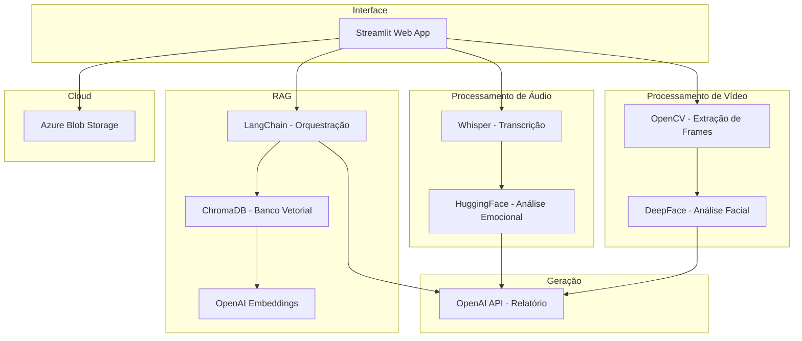
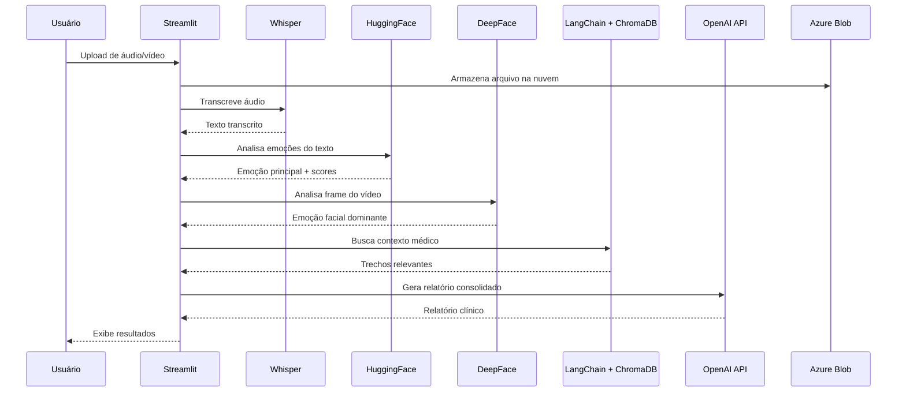

# 🩺 Assistente Multimodal para Apoio Emocional em Saúde da Mulher

**Projeto acadêmico de pós-graduação — FIAP**

Sistema de IA multimodal que combina análise de áudio, vídeo, NLP e visão computacional para apoiar profissionais de saúde na identificação de padrões emocionais em consultas voltadas à saúde da mulher.

> ⚠️ **Este é um protótipo acadêmico.** Não se destina a uso clínico real. Não substitui avaliação médica profissional.

---

## 📋 Visão Geral

O sistema processa dados multimodais (áudio e vídeo de consultas) para:

- Transcrever falas utilizando Whisper
- Identificar emoções no texto transcrito via HuggingFace Transformers
- Analisar expressões faciais em vídeo com DeepFace
- Consultar protocolos médicos via busca semântica (RAG)
- Gerar relatórios clínicos consolidados com IA generativa
- Armazenar arquivos em nuvem via Azure Blob Storage

O objetivo é demonstrar a viabilidade técnica de um pipeline multimodal aplicado ao contexto de saúde emocional feminina.

---

## 🏗️ Arquitetura



---

## 🔄 Pipeline Multimodal



---

## 🛠️ Tecnologias

| Tecnologia | Função | Versão |
|---|---|---|
| **Streamlit** | Interface web interativa | 1.x |
| **OpenAI Whisper** | Transcrição de áudio (speech-to-text) | base |
| **HuggingFace Transformers** | Classificação emocional de texto | distilroberta |
| **DeepFace** | Análise de expressões faciais | latest |
| **OpenCV** | Processamento de vídeo e extração de frames | 4.x |
| **LangChain** | Orquestração do pipeline RAG | latest |
| **ChromaDB** | Banco de dados vetorial local | latest |
| **OpenAI API** | Geração de relatórios (GPT-4o-mini) | latest |
| **Azure Blob Storage** | Armazenamento de arquivos em nuvem | latest |

---

## 📁 Estrutura de Pastas

```
├── app.py                      # Aplicação principal Streamlit
├── audio/
│   ├── processor.py            # Transcrição com Whisper
│   └── emotion_analyzer.py     # Análise emocional com HuggingFace
├── video/
│   └── processor.py            # Análise facial com DeepFace + OpenCV
├── rag/
│   ├── ingest.py               # Ingestão de PDFs para ChromaDB
│   ├── query.py                # Busca semântica no banco vetorial
│   └── documents/              # PDFs de protocolos médicos
├── cloud/
│   └── azure_blob.py           # Upload para Azure Blob Storage
├── reports/
│   └── generator.py            # Geração de relatório com OpenAI API
├── .chroma/                    # Banco vetorial persistido (gerado)
├── .env                        # Variáveis de ambiente
├── requirements.txt            # Dependências Python
└── README.md
```

---

## 🚀 Instruções de Execução

### Pré-requisitos

- Python 3.10+
- FFmpeg instalado (necessário para Whisper)
- Conta OpenAI com API key
- Conta Azure com Blob Storage configurado (opcional)

### 1. Clonar o repositório

```bash
git clone <url-do-repositorio>
cd <nome-do-projeto>
```

### 2. Criar ambiente virtual

```bash
python -m venv venv
source venv/bin/activate  # Linux/Mac
# venv\Scripts\activate   # Windows
```

### 3. Instalar dependências

```bash
pip install -r requirements.txt
```

### 4. Configurar variáveis de ambiente

Criar arquivo `.env` na raiz do projeto:

```env
OPENAI_API_KEY=sk-...
AZURE_STORAGE_CONNECTION_STRING=DefaultEndpointsProtocol=https;AccountName=...
AZURE_CONTAINER_NAME=nome-do-container
```

### 5. Ingerir documentos médicos (RAG)

Colocar PDFs na pasta `rag/documents/` e executar:

```bash
python -m rag.ingest
```

### 6. Executar a aplicação

```bash
streamlit run app.py
```

---

## 💡 Exemplos de Uso

### Análise de Áudio

1. Faça upload de um arquivo `.wav` ou `.mp3` com gravação de consulta
2. O sistema transcreve automaticamente com Whisper
3. Analisa emoções no texto (joy, sadness, fear, anger, etc.)
4. Gera alerta clínico baseado na emoção predominante

### Análise de Vídeo

1. Faça upload de um arquivo `.mp4` ou `.mov`
2. O sistema extrai um frame central do vídeo
3. Analisa expressão facial com DeepFace
4. Exibe emoção dominante e score de confiança

### Busca RAG

1. Digite uma pergunta sobre protocolos médicos
2. O sistema busca semanticamente nos documentos ingeridos
3. Retorna os 3 trechos mais relevantes com score de similaridade

### Relatório Consolidado

1. Após processar áudio e/ou vídeo
2. Clique em "Gerar Relatório"
3. O sistema consolida todas as análises em um relatório clínico estruturado

---

## ⚖️ Limitações Éticas

- **Viés algorítmico**: Modelos de IA podem apresentar vieses culturais e de gênero na detecção de emoções
- **Contexto limitado**: A análise de um único frame ou trecho de áudio não representa o estado emocional completo
- **Falsos positivos**: Alertas clínicos são indicativos e podem não refletir a realidade do paciente
- **Privacidade**: Dados de áudio e vídeo de consultas são sensíveis e requerem consentimento informado
- **Generalização**: O modelo de emoções foi treinado em inglês e pode ter desempenho reduzido em português
- **Não determinístico**: Resultados podem variar entre execuções

---

## 🔮 Melhorias Futuras

- [ ] Suporte a múltiplos frames do vídeo (análise temporal)
- [ ] Modelo de emoções fine-tuned para português brasileiro
- [ ] Integração com prontuário eletrônico
- [ ] Análise de prosódia (tom de voz, ritmo, pausas)
- [ ] Dashboard de acompanhamento longitudinal
- [ ] Autenticação e controle de acesso (LGPD)
- [ ] Testes automatizados e CI/CD
- [ ] Deploy em ambiente cloud (Azure App Service)
- [ ] Suporte a múltiplos idiomas
- [ ] Validação clínica com profissionais de saúde

---

## ⚕️ Disclaimer Médico

> **Este sistema é um protótipo acadêmico desenvolvido como trabalho de pós-graduação na FIAP.**
>
> - Não se destina a uso clínico real
> - Não substitui avaliação médica profissional
> - Não deve ser utilizado para diagnóstico ou tratamento
> - Os resultados são meramente indicativos e experimentais
> - Qualquer decisão clínica deve ser tomada por profissionais qualificados
>
> O projeto tem como objetivo demonstrar a viabilidade técnica de um pipeline multimodal aplicado à saúde, servindo como prova de conceito para discussão acadêmica.

---

## 👥 Autores

Projeto desenvolvido como parte do programa de pós-graduação em Inteligência Artificial — FIAP.

---

## 📄 Licença

Projeto acadêmico — uso restrito ao contexto educacional.
