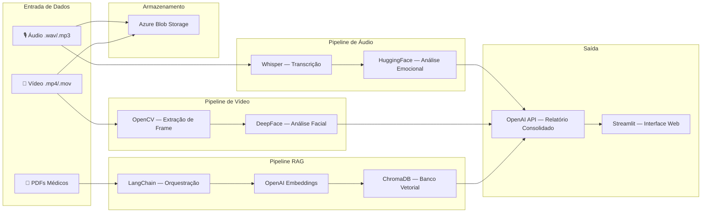
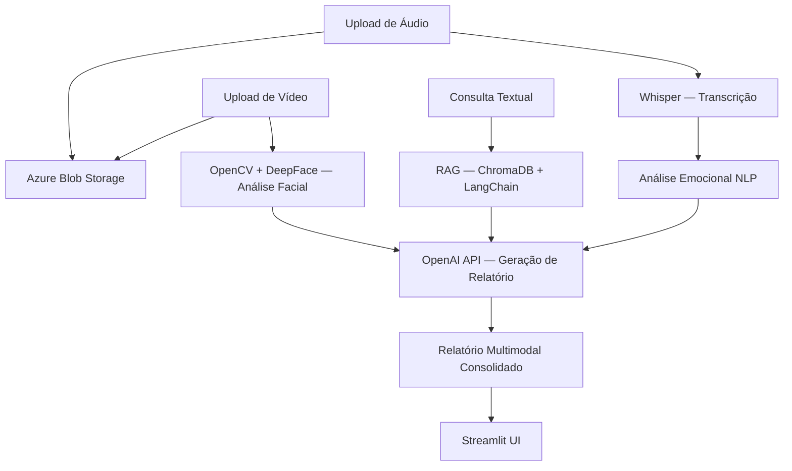
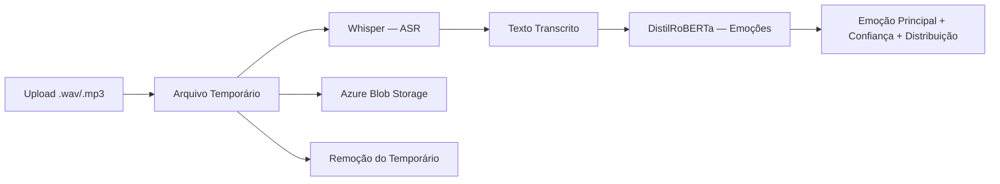
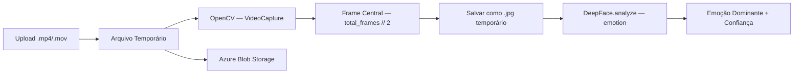

# Tech Challenge IADT - Fase 4

**Instituição:** FIAP - Tech Challenge (IADT)  
**Fase:** 4   
**Projeto:** Assistente Multimodal para Apoio Emocional em Saúde da Mulher  

Integrantes do Grupo

- **Nome:** Bruno Quadrotti de Freitas
- **RM:** 368164
- **Grupo:** 54

Entregáveis

- **Link do projeto no Github:** https://github.com/brunoquadrotti/tech_challenge_fiap_fase4
- **Link do vídeo no YouTube (demonstração):** https://youtu.be/ID

---

## 1. Introdução

A saúde emocional da mulher — especialmente durante o período gestacional e puerperal — constitui um desafio significativo para os sistemas de saúde. Segundo a Organização Mundial da Saúde (OMS), transtornos como depressão pós-parto afetam entre 10% e 15% das mulheres globalmente, com subnotificação expressiva em países em desenvolvimento. A detecção precoce de sinais de sofrimento emocional é fator determinante para intervenções eficazes, porém a escassez de profissionais especializados e a dificuldade de acesso a serviços de saúde mental limitam o alcance da triagem convencional.

Neste contexto, o presente trabalho propõe o desenvolvimento de um protótipo acadêmico de assistente multimodal que combina técnicas de Processamento de Linguagem Natural (NLP), Visão Computacional e Recuperação Aumentada por Geração (RAG) para apoiar profissionais de saúde na identificação de indicadores emocionais. O sistema processa relatos em áudio — transcritos automaticamente e classificados emocionalmente — e expressões faciais capturadas em vídeo, correlacionando os achados com protocolos médicos indexados em uma base vetorial.

A solução não se propõe a realizar diagnósticos clínicos. Trata-se de uma ferramenta de apoio assistido, cujos resultados são indicativos e devem ser interpretados exclusivamente por profissionais qualificados. O valor do sistema reside na capacidade de sistematizar e consolidar informações multimodais que, de outra forma, dependeriam inteiramente da observação subjetiva durante consultas presenciais.

> **Disclaimer:** Este é um protótipo acadêmico desenvolvido para fins de pesquisa e aprendizado. Os resultados gerados pelo sistema são indicativos e não substituem avaliação médica profissional. Nenhuma decisão clínica deve ser tomada exclusivamente com base nas saídas deste sistema.

---

## 2. Objetivos do Projeto

### 2.1 Objetivo Geral

Projetar e implementar um sistema multimodal de apoio clínico assistido, capaz de processar sinais emocionais provenientes de áudio (fala) e vídeo (expressão facial), correlacionando-os com protocolos médicos recuperados semanticamente, para gerar relatórios consolidados que auxiliem profissionais de saúde na triagem emocional de pacientes no contexto da saúde da mulher.

### 2.2 Objetivos Específicos

1. Implementar pipeline de transcrição automática de relatos em áudio utilizando o modelo Whisper (OpenAI), com suporte a arquivos `.wav` e `.mp3`.
2. Aplicar classificação emocional sobre o texto transcrito utilizando modelo pré-treinado de NLP (`j-hartmann/emotion-english-distilroberta-base`) via HuggingFace Transformers.
3. Desenvolver pipeline de análise de expressões faciais em vídeo, combinando extração de frames com OpenCV e inferência emocional com DeepFace.
4. Construir sistema de Recuperação Aumentada por Geração (RAG) com ingestão de documentos médicos em PDF, vetorização via OpenAI Embeddings e busca semântica em ChromaDB orquestrada por LangChain.
5. Integrar as três modalidades (áudio, vídeo, RAG) em um gerador de relatórios clínicos consolidados via OpenAI API (GPT-4o-mini).
6. Implementar persistência de mídias processadas em Azure Blob Storage para rastreabilidade.
7. Disponibilizar todas as funcionalidades em interface web interativa construída com Streamlit, com feedback visual em tempo real.

---

## 3. Arquitetura da Solução

A arquitetura do sistema segue o padrão de pipelines modulares desacoplados, onde cada modalidade de entrada (áudio, vídeo, documentos) é processada por um pipeline independente. Os resultados convergem em um módulo de síntese que utiliza um Large Language Model (LLM) para gerar o relatório consolidado. Esta abordagem permite evolução, teste e manutenção independentes de cada componente.

### 3.1 Princípios Arquiteturais

- **Modularidade:** Cada pipeline é encapsulado em módulo Python independente com interface bem definida.
- **Cache de recursos:** Modelos pesados (Whisper, DistilRoBERTa, DeepFace) são carregados uma única vez via `@st.cache_resource`, evitando reinicialização a cada interação.
- **Tolerância a falhas:** Cada módulo implementa tratamento de exceções com fallback gracioso, garantindo que a falha de um pipeline não comprometa os demais.
- **Separação de responsabilidades:** Interface (Streamlit), processamento (pipelines), armazenamento (Azure/ChromaDB) e geração (OpenAI) operam em camadas distintas.

### 3.2 Diagrama de Arquitetura



### 3.3 Estrutura de Diretórios

```
├── app.py                  # Aplicação principal (Streamlit)
├── audio/
│   ├── processor.py        # Transcrição com Whisper
│   └── emotion_analyzer.py # Classificação emocional (NLP)
├── video/
│   └── processor.py        # Análise facial com DeepFace + OpenCV
├── rag/
│   ├── ingest.py           # Ingestão de PDFs no ChromaDB
│   ├── query.py            # Busca semântica vetorial
│   └── documents/          # PDFs de protocolos médicos
├── cloud/
│   └── azure_blob.py       # Upload para Azure Blob Storage
├── reports/
│   └── generator.py        # Geração de relatório com GPT-4o-mini
├── docs/
│   └── architecture.md     # Diagramas Mermaid da arquitetura
├── .chroma/                # Banco vetorial persistido
├── .env                    # Variáveis de ambiente (não versionado)
└── requirements.txt        # Dependências do projeto
```

---

## 4. Fluxo Multimodal

O sistema opera em um fluxo multimodal convergente: múltiplas fontes de dados são processadas em paralelo por pipelines especializados, e os resultados são unificados em uma etapa de síntese. Este padrão é análogo à abordagem de *late fusion* em sistemas multimodais, onde cada modalidade é processada independentemente antes da integração.

### 4.1 Diagrama de Fluxo



### 4.2 Descrição das Etapas

1. **Entrada:** O profissional de saúde acessa a interface Streamlit e realiza upload de áudio (relato verbal da paciente) e/ou vídeo (gravação facial durante relato).
2. **Transcrição (ASR):** O áudio é processado pelo Whisper, que converte fala em texto com suporte multilíngue.
3. **Classificação Emocional (NLP):** O texto transcrito é submetido ao modelo DistilRoBERTa, que retorna distribuição de probabilidade sobre 7 classes emocionais.
4. **Análise Facial:** O vídeo tem seu frame central extraído via OpenCV. O frame é analisado pelo DeepFace, que infere a emoção dominante a partir de landmarks faciais.
5. **Recuperação Semântica (RAG):** O profissional pode realizar consultas textuais que são vetorizadas e comparadas com chunks de documentos médicos indexados no ChromaDB.
6. **Síntese:** Os resultados das três modalidades são formatados e enviados como contexto ao GPT-4o-mini, que gera um relatório clínico estruturado.
7. **Persistência:** Os arquivos de mídia originais são enviados ao Azure Blob Storage para rastreabilidade e auditoria.
8. **Apresentação:** O relatório consolidado é exibido na interface com métricas, alertas e recomendações.

### 4.3 Gestão de Estado

O Streamlit `session_state` mantém os resultados de cada pipeline entre interações, permitindo que o relatório final seja gerado somente quando o profissional julgar que possui dados suficientes. Isso confere flexibilidade ao fluxo: é possível analisar apenas áudio, apenas vídeo, ou ambos combinados com consulta RAG.

---

## 5. Tecnologias Utilizadas

A seleção tecnológica priorizou bibliotecas consolidadas no ecossistema Python de IA, com preferência por soluções que oferecem bom equilíbrio entre facilidade de integração, documentação e performance adequada para um protótipo acadêmico.

| Camada | Tecnologia | Versão/Modelo | Função no Sistema |
|--------|-----------|---------------|-------------------|
| Interface | Streamlit | latest | Interface web reativa com widgets de upload, métricas e visualização |
| Transcrição | OpenAI Whisper | modelo `base` (74M params) | Automatic Speech Recognition (ASR) multilíngue |
| NLP Emocional | HuggingFace Transformers | `distilroberta-base` | Classificação de emoções em texto (7 classes) |
| Visão Computacional | OpenCV (`cv2`) | latest | Captura de vídeo e extração de frames |
| Análise Facial | DeepFace | latest | Inferência de emoção dominante via expressão facial |
| Orquestração RAG | LangChain + LangChain Community | latest | Pipeline de ingestão, chunking e recuperação |
| Banco Vetorial | ChromaDB | latest | Armazenamento e busca por similaridade de embeddings |
| Embeddings | OpenAI Embeddings | `text-embedding-ada-002` | Vetorização semântica de chunks textuais |
| Geração de Texto | OpenAI GPT-4o-mini | via API | Síntese de relatório clínico a partir de contexto multimodal |
| Armazenamento Cloud | Azure Blob Storage | SDK Python | Persistência de arquivos de mídia para rastreabilidade |
| Linguagem | Python | 3.10+ | Linguagem base de desenvolvimento |
| Gerenciamento de Config | python-dotenv | latest | Carregamento de variáveis de ambiente sensíveis |

### 5.1 Justificativa das Escolhas

- **Whisper** foi selecionado por ser o estado da arte em ASR open-source com suporte nativo a português, eliminando dependência de APIs externas para transcrição.
- **HuggingFace Transformers** permite execução local do modelo de emoções, garantindo baixa latência e independência de chamadas de rede para inferência NLP.
- **DeepFace** abstrai a complexidade de múltiplos backends de reconhecimento facial (VGG-Face, Facenet, OpenFace), oferecendo API unificada.
- **LangChain** fornece abstrações maduras para pipelines RAG, com integração nativa com ChromaDB e OpenAI.
- **ChromaDB** foi escolhido por ser um banco vetorial leve, persistível localmente, adequado para prototipagem sem infraestrutura adicional.
- **Streamlit** permite construção rápida de interfaces interativas com Python puro, ideal para demonstrações acadêmicas.

---

## 6. Modelos Aplicados

### 6.1 Whisper (OpenAI) — Transcrição de Fala

| Atributo | Valor |
|----------|-------|
| Modelo | `base` |
| Parâmetros | 74 milhões |
| Tarefa | Automatic Speech Recognition (ASR) |
| Idiomas | Multilíngue (99 idiomas, incluindo português) |
| Entrada | Áudio `.wav` ou `.mp3` |
| Saída | Texto transcrito |

O Whisper é um modelo encoder-decoder baseado em Transformer, treinado em 680.000 horas de áudio supervisionado coletado da web. A variante `base` foi selecionada por oferecer equilíbrio entre acurácia e tempo de inferência em hardware sem GPU dedicada. Para o escopo deste protótipo — áudios curtos de relatos verbais — o modelo demonstra performance satisfatória em português, embora modelos maiores (`medium`, `large`) ofereçam melhor acurácia para áudios com ruído ou sotaques regionais.

**Implementação:** A classe `AudioProcessor` encapsula o carregamento do modelo (realizado uma única vez) e expõe o método `transcribe(audio_path)` que retorna o texto extraído.

### 6.2 DistilRoBERTa — Classificação Emocional

| Atributo | Valor |
|----------|-------|
| Modelo | `j-hartmann/emotion-english-distilroberta-base` |
| Base | DistilRoBERTa (destilação do RoBERTa) |
| Classes | 7 (anger, disgust, fear, joy, neutral, sadness, surprise) |
| Tarefa | Text Classification (multi-class) |
| Entrada | Texto (string) |
| Saída | Distribuição de probabilidade sobre as 7 classes |

Este modelo foi treinado especificamente para detecção de emoções em texto, utilizando datasets consolidados de análise de sentimentos. A arquitetura DistilRoBERTa oferece 40% menos parâmetros que o RoBERTa original com perda mínima de performance, permitindo inferência rápida em CPU.

**Limitação conhecida:** O modelo foi treinado em inglês. Textos em português passam por inferência cross-lingual implícita, o que pode reduzir a acurácia. Para produção, recomenda-se fine-tuning com corpus em português.

**Implementação:** A classe `EmotionAnalyzer` utiliza o pipeline `text-classification` do HuggingFace com `top_k=None` para retornar scores de todas as classes, ordenadas por confiança decrescente.

### 6.3 DeepFace — Análise de Expressão Facial

| Atributo | Valor |
|----------|-------|
| Framework | DeepFace |
| Backend padrão | VGG-Face |
| Ações | `["emotion"]` |
| Classes | 7 (angry, disgust, fear, happy, sad, surprise, neutral) |
| Entrada | Imagem (frame extraído do vídeo) |
| Saída | Emoção dominante + distribuição percentual |

O DeepFace é um framework que unifica múltiplos modelos de reconhecimento facial sob uma API consistente. Para análise emocional, utiliza um modelo CNN treinado no dataset FER-2013 (35.887 imagens faciais rotuladas). O parâmetro `enforce_detection=False` garante que o sistema não falhe quando a detecção facial não é conclusiva — cenário comum em vídeos com iluminação irregular ou ângulos não frontais.

**Implementação:** A classe `VideoProcessor` combina OpenCV (extração de frame) com DeepFace (inferência emocional), retornando emoção dominante e score de confiança normalizado.

### 6.4 GPT-4o-mini (OpenAI API) — Geração de Relatório

| Atributo | Valor |
|----------|-------|
| Modelo | `gpt-4o-mini` |
| Temperatura | 0.7 |
| Max tokens | 1500 |
| Papel | Síntese de relatório clínico multimodal |
| Entrada | Contexto estruturado (emoções áudio + vídeo + trechos RAG) |
| Saída | Relatório em Markdown com seções padronizadas |

O GPT-4o-mini atua como módulo de síntese, recebendo os resultados das análises anteriores formatados em prompt estruturado e gerando um relatório com seções predefinidas: resumo emocional, emoções detectadas, sinais de sofrimento, contexto médico, recomendação preventiva e disclaimer obrigatório. A temperatura 0.7 equilibra coerência e variabilidade na geração.

**Implementação:** A classe `ReportGenerator` formata os inputs de cada modalidade em texto estruturado, constrói o prompt com instruções de formato e envia à API via SDK oficial da OpenAI.

---

## 7. Pipeline RAG

O módulo de Recuperação Aumentada por Geração (RAG) permite que o sistema consulte uma base de conhecimento médica indexada, enriquecendo os relatórios com informações de protocolos oficiais. A abordagem RAG evita a necessidade de fine-tuning do LLM com dados médicos, utilizando recuperação semântica para injetar contexto relevante no momento da geração.

### 7.1 Ingestão de Documentos

O pipeline de ingestão (`rag/ingest.py`) processa documentos PDF e os armazena como vetores semânticos:

| Etapa | Componente | Configuração |
|-------|-----------|--------------|
| Carregamento | `PyPDFLoader` (LangChain) | Extração de texto por página |
| Chunking | `RecursiveCharacterTextSplitter` | `chunk_size=1000`, `chunk_overlap=200` |
| Embedding | `OpenAIEmbeddings` | Modelo `text-embedding-ada-002` (1536 dimensões) |
| Persistência | ChromaDB | Diretório local `.chroma/` |

O `chunk_overlap` de 200 caracteres garante que informações em fronteiras de chunks não sejam perdidas, mantendo coerência semântica entre fragmentos adjacentes.

### 7.2 Base de Conhecimento

Os documentos ingeridos são publicações oficiais do Ministério da Saúde e órgãos competentes:

| Documento | Fonte | Relevância |
|-----------|-------|-----------|
| Caderneta Brasileira da Gestante | Ministério da Saúde | Acompanhamento pré-natal e sinais de alerta |
| Depressão Pós-Parto | Ministério da Saúde | Sintomas, fatores de risco e protocolos de triagem |
| Guia Prático de Cuidado à Mulher em Situação de Violência | Ministério da Saúde | Identificação de sinais e fluxo de atendimento |

### 7.3 Busca Semântica

A consulta (`rag/query.py`) vetoriza a pergunta do usuário com o mesmo modelo de embeddings utilizado na ingestão e realiza busca por similaridade cosseno no ChromaDB, retornando os `top_k=3` trechos mais relevantes com score de similaridade.


### 7.4 Integração com Geração de Relatório

Os trechos recuperados são truncados em 300 caracteres cada e inseridos na seção "Contexto Médico" do prompt enviado ao GPT-4o-mini. Isso permite que o relatório gerado referencie protocolos oficiais sem que o modelo precise ter sido treinado com esses dados específicos.

---

## 8. Processamento de Áudio

O pipeline de áudio é responsável por converter relatos verbais em indicadores emocionais quantificáveis, operando em duas etapas sequenciais: transcrição e classificação.

### 8.1 Pipeline Detalhado



1. **Upload e armazenamento temporário:** O arquivo é salvo em diretório temporário do sistema operacional com extensão preservada.
2. **Transcrição ASR:** O Whisper processa o áudio e retorna texto transcrito. O modelo opera localmente sem chamadas de rede.
3. **Classificação emocional:** O texto transcrito é submetido ao pipeline de classificação, que retorna scores para todas as 7 classes emocionais.
4. **Upload cloud:** O arquivo original é enviado ao Azure Blob Storage no path `audio/{filename}`.
5. **Limpeza:** O arquivo temporário é removido em bloco `finally`, garantindo limpeza mesmo em caso de exceção.

### 8.2 Sistema de Alertas Clínicos

O sistema implementa um mapeamento entre emoções detectadas e níveis de alerta para triagem:

| Emoção Detectada | Nível de Alerta | Mensagem ao Profissional |
|-----------------|----------------|--------------------------|
| sadness | 🔴 Crítico | Possível sofrimento emocional detectado |
| fear | 🟡 Atenção | Possível sinal de ansiedade ou insegurança emocional |
| anger | 🟡 Atenção | Possível estresse elevado identificado |
| disgust | 🟡 Atenção | Possível desconforto ou aversão emocional |
| surprise | ℹ️ Informativo | Reação de surpresa detectada — avaliar contexto |
| joy | ℹ️ Informativo | Estado emocional positivo identificado |
| neutral | ℹ️ Informativo | Estado emocional neutro — sem alertas relevantes |

Os alertas são apresentados com codificação visual (cores e ícones) para facilitar a interpretação rápida pelo profissional de saúde.

> **Importante:** Os alertas são indicativos e representam uma sugestão de atenção, não um diagnóstico. A interpretação clínica cabe exclusivamente ao profissional qualificado.

### 8.3 Screenshot — Interface de Áudio

<!-- TODO: Inserir screenshot da interface de upload e análise de áudio -->


---

## 9. Processamento de Vídeo

O pipeline de vídeo complementa a análise textual com informações visuais sobre o estado emocional da paciente, utilizando reconhecimento de expressões faciais como modalidade adicional de evidência.

### 9.1 Pipeline Detalhado



1. **Upload e armazenamento temporário:** O vídeo é salvo localmente com extensão original preservada.
2. **Abertura do vídeo:** `cv2.VideoCapture` abre o arquivo e obtém metadados (total de frames).
3. **Extração de frame:** O frame localizado no ponto médio temporal (`total_frames // 2`) é extraído via `cap.set()` + `cap.read()`.
4. **Persistência do frame:** O frame é salvo como JPEG em diretório temporário para processamento pelo DeepFace.
5. **Análise facial:** `DeepFace.analyze()` processa a imagem com ação `["emotion"]`, retornando distribuição percentual sobre 7 emoções.
6. **Normalização:** O score da emoção dominante é normalizado de 0-100 para 0.0-1.0.

### 9.2 Estratégia de Extração de Frame

A extração do frame central é uma simplificação deliberada para o escopo do protótipo. A premissa é que vídeos de entrada são curtos (< 60 segundos) e focados no rosto da paciente durante um relato. O frame central tende a capturar a expressão predominante durante a fala.

**Limitações desta abordagem:**
- Não captura variações emocionais ao longo do vídeo.
- Pode selecionar frame com olhos fechados ou expressão transitória.
- Não implementa tracking facial para múltiplos rostos.

### 9.3 Parâmetro `enforce_detection=False`

Este parâmetro instrui o DeepFace a não lançar exceção quando nenhum rosto é detectado com alta confiança. Em vez disso, o modelo tenta inferir emoção mesmo com detecção parcial. Isso é necessário para robustez em cenários reais onde iluminação, ângulo ou resolução podem dificultar a detecção facial.

### 9.4 Screenshot — Interface de Vídeo

<!-- TODO: Inserir screenshot da interface de upload e análise de vídeo -->


---

## 10. Integração com Azure Blob Storage

O módulo de armazenamento cloud (`cloud/azure_blob.py`) implementa persistência de arquivos de mídia processados no Azure Blob Storage, atendendo a requisitos de rastreabilidade e potencial auditoria clínica.

### 10.1 Motivação

Em um cenário de uso real, a persistência dos arquivos originais (áudio e vídeo) é necessária para:
- **Rastreabilidade:** Permitir revisão posterior dos dados que geraram um relatório.
- **Auditoria:** Manter registro dos inputs para validação de resultados.
- **Reprocessamento:** Possibilitar reanálise com modelos atualizados no futuro.

### 10.2 Implementação

A classe `AzureBlobService` encapsula a interação com o SDK `azure-storage-blob`:

| Aspecto | Implementação |
|---------|--------------|
| Autenticação | Connection string via variável de ambiente (`AZURE_STORAGE_CONNECTION_STRING`) |
| Container | Configurável via `AZURE_CONTAINER_NAME` |
| Upload | `upload_blob(data, overwrite=True)` — sobrescreve blobs existentes |
| Organização | Prefixos `audio/` e `video/` para segregação por tipo |
| Tolerância a falhas | Fallback gracioso se Azure não estiver configurado |

### 10.3 Organização dos Blobs

```
container/
├── audio/
│   ├── relato-paciente-001.mp3
│   ├── relato-paciente-002.wav
│   └── ...
└── video/
    ├── sessao-paciente-001.mp4
    ├── sessao-paciente-002.mov
    └── ...
```

### 10.4 Considerações de Segurança

- A connection string é armazenada em `.env` (não versionado no Git).
- O sistema opera com `overwrite=True`, o que simplifica o fluxo mas não preserva versões anteriores.
- Em produção, recomenda-se implementar versionamento de blobs, criptografia at-rest e políticas de retenção conforme LGPD.

---

## 11. Resultados Obtidos

Os resultados apresentados nesta seção foram obtidos durante testes funcionais do protótipo com amostras de áudio e vídeo controladas. Não se trata de validação clínica formal — os dados servem para demonstrar o funcionamento end-to-end do sistema.

### 11.1 Transcrição de Áudio (Whisper)

O modelo Whisper `base` transcreveu com sucesso áudios em português brasileiro de duração variável (15s a 120s). Observações:

- **Áudios claros (sem ruído):** Transcrição com alta fidelidade, preservando estrutura frasal e vocabulário.
- **Áudios com ruído ambiente:** Ocorrência de omissões e substituições pontuais, sem comprometer a análise emocional subsequente.
- **Sotaques regionais:** Performance adequada para sotaques urbanos; não testado extensivamente com variações dialetais.

A transcrição gerada alimenta diretamente o classificador emocional, portanto erros de transcrição podem propagar-se para a etapa seguinte.

### 11.2 Classificação Emocional (NLP)

O modelo DistilRoBERTa retornou classificações coerentes com o conteúdo semântico dos textos transcritos:

| Tipo de Relato | Emoção Classificada | Confiança Típica |
|---------------|--------------------|--------------------|
| Relato de tristeza/choro | sadness | 70%–90% |
| Relato neutro/informativo | neutral | 80%–95% |
| Relato com expressões de medo | fear | 60%–80% |
| Relato positivo/alívio | joy | 65%–85% |

**Observação:** A confiança tende a ser menor para textos em português comparado a textos em inglês, dado o treinamento monolíngue do modelo. Textos mais longos e semanticamente ricos produzem classificações mais estáveis.

### 11.3 Análise Facial (DeepFace)

O DeepFace identificou emoções faciais em frames extraídos dos vídeos de teste:

- **Condições ideais (iluminação frontal, rosto centralizado):** Detecção consistente com confiança acima de 60%.
- **Condições adversas (iluminação lateral, óculos, máscara parcial):** Detecção funcional com `enforce_detection=False`, porém com confiança reduzida.
- **Concordância intermodal:** Em cenários onde áudio e vídeo expressam a mesma emoção, o sistema gera alertas mais assertivos.

### 11.4 Busca Semântica (RAG)

A busca vetorial demonstrou capacidade de recuperar trechos contextualmente relevantes:

- Consulta "sintomas de depressão pós-parto" → Recuperou trechos do documento do Ministério da Saúde sobre DPP.
- Consulta "sinais de violência doméstica" → Recuperou trechos do Guia Prático de Cuidado à Mulher.
- Consulta "acompanhamento pré-natal" → Recuperou trechos da Caderneta da Gestante.

Os scores de similaridade variaram entre 0.70 e 0.92 para consultas bem formuladas.

### 11.5 Relatório Consolidado

O GPT-4o-mini gerou relatórios estruturados que sintetizam as informações multimodais de forma coerente, mantendo linguagem profissional e incluindo o disclaimer obrigatório. Os relatórios seguem consistentemente a estrutura de 6 seções definida no prompt.

### 11.6 Screenshot — Relatório Gerado

<!-- TODO: Inserir screenshot do relatório clínico consolidado gerado pelo sistema -->


---

## 12. Exemplos de Anomalias Detectadas

Esta seção apresenta cenários representativos de detecção de padrões emocionais pelo sistema. Os exemplos ilustram como a convergência multimodal pode sinalizar situações que merecem atenção clínica.

### 12.1 Cenário A: Convergência de Indicadores de Sofrimento Emocional

**Contexto:** Paciente gestante de 28 semanas relata dificuldades emocionais em áudio de 45 segundos. Vídeo frontal gravado simultaneamente.

| Modalidade | Modelo | Resultado | Confiança |
|-----------|--------|-----------|-----------|
| Áudio → Texto → NLP | DistilRoBERTa | sadness | 84.2% |
| Vídeo → Frame → Facial | DeepFace | sad | 71.8% |

**Alerta gerado:** 🔴 Possível sofrimento emocional detectado.

**Contexto RAG recuperado:** Trecho do documento "Depressão Pós-Parto — Ministério da Saúde" descrevendo fatores de risco durante o terceiro trimestre gestacional.

**Relatório gerado:** O GPT-4o-mini sintetizou a concordância entre modalidades, destacando a convergência de indicadores de tristeza em ambos os canais (verbal e facial) e referenciando o protocolo de triagem para DPP.

**Interpretação:** A concordância intermodal (mesma emoção detectada em áudio e vídeo) aumenta a relevância do alerta. O profissional de saúde pode utilizar esta informação como ponto de partida para investigação clínica aprofundada.

### 12.2 Cenário B: Divergência Intermodal

**Contexto:** Paciente relata estar "bem" em áudio, porém expressão facial sugere emoção diferente.

| Modalidade | Modelo | Resultado | Confiança |
|-----------|--------|-----------|-----------|
| Áudio → Texto → NLP | DistilRoBERTa | neutral | 72.1% |
| Vídeo → Frame → Facial | DeepFace | sad | 63.4% |

**Alerta gerado:** ℹ️ Estado emocional neutro (baseado no áudio).

**Observação:** A divergência entre modalidades pode indicar dissimulação emocional ou limitação dos modelos. Este cenário evidencia a importância da análise multimodal: uma única modalidade pode não capturar o estado emocional real.

### 12.3 Cenário C: Estado Emocional Positivo

**Contexto:** Paciente em consulta de retorno relata melhora após acompanhamento.

| Modalidade | Modelo | Resultado | Confiança |
|-----------|--------|-----------|-----------|
| Áudio → Texto → NLP | DistilRoBERTa | joy | 78.5% |
| Vídeo → Frame → Facial | DeepFace | happy | 82.3% |

**Alerta gerado:** ℹ️ Estado emocional positivo identificado.

**Interpretação:** A convergência positiva pode servir como indicador de evolução favorável no acompanhamento longitudinal.

> **Nota:** Os valores de confiança apresentados são representativos de testes realizados com amostras controladas. Em cenários reais, a variabilidade é esperada e os resultados devem ser contextualizados pelo profissional.

---

## 13. Limitações Éticas

### 13.1 Limitações Técnicas

| Limitação | Impacto | Mitigação Possível |
|-----------|---------|-------------------|
| Modelo NLP treinado em inglês | Redução de acurácia em português | Fine-tuning com corpus PT-BR |
| Frame único extraído do vídeo | Não captura variação temporal | Análise multi-frame com agregação |
| Whisper `base` (74M params) | Erros em áudio ruidoso/sotaques | Upgrade para modelo `medium` ou `large` |
| Base RAG limitada (3 PDFs) | Cobertura restrita de protocolos | Expansão da base documental |
| DeepFace com detecção relaxada | Possíveis falsos positivos faciais | Threshold de confiança mínima |
| GPT-4o-mini como sintetizador | Possíveis alucinações na geração | Validação humana obrigatória |

### 13.2 Considerações Éticas

**Não é diagnóstico.** O sistema não realiza, em nenhuma circunstância, diagnóstico clínico. Os resultados são indicadores computacionais que devem ser interpretados exclusivamente por profissionais de saúde qualificados, dentro do contexto clínico completo da paciente.

**Viés algorítmico.** Os modelos utilizados foram treinados predominantemente com dados de populações específicas (majoritariamente anglófonas e de pele clara para modelos faciais). Isso pode resultar em performance desigual para diferentes etnias, idades e contextos culturais. A consciência deste viés é fundamental para interpretação responsável dos resultados.

**Privacidade e LGPD.** Dados de áudio e vídeo de pacientes são dados pessoais sensíveis conforme a Lei Geral de Proteção de Dados (Lei 13.709/2018). O uso em contexto real exige:
- Consentimento livre, informado e inequívoco da paciente.
- Base legal adequada para tratamento (finalidade de saúde).
- Medidas técnicas de segurança (criptografia, controle de acesso).
- Política de retenção e descarte de dados.
- Relatório de Impacto à Proteção de Dados Pessoais (RIPD).

**Supervisão humana obrigatória.** O sistema é projetado como ferramenta de apoio ao profissional, nunca como substituto do julgamento clínico. Decisões sobre encaminhamento, tratamento ou intervenção devem ser tomadas exclusivamente pelo profissional de saúde com base em avaliação clínica completa.

**Risco de sobre-confiança.** Existe o risco de que profissionais depositem confiança excessiva nos outputs do sistema. A interface inclui disclaimers visuais permanentes para mitigar este risco.

### 13.3 Disclaimer Obrigatório

> ⚕️ **Este sistema não substitui avaliação médica profissional.** Os resultados são indicativos e devem ser interpretados por um especialista qualificado. Nenhuma decisão clínica deve ser tomada exclusivamente com base nas saídas deste sistema. Trata-se de um protótipo acadêmico desenvolvido para fins de pesquisa e aprendizado.

---

## 14. Melhorias Futuras

As melhorias estão organizadas por horizonte de implementação:

### 14.1 Curto Prazo (próxima iteração)

- **Análise multi-frame:** Processar N frames distribuídos ao longo do vídeo e agregar emoções por média ponderada ou votação majoritária, capturando variações temporais.
- **Threshold de confiança:** Implementar limiar mínimo de confiança (ex: 50%) abaixo do qual o sistema indica "inconclusivo" em vez de classificar.
- **Expansão da base RAG:** Incluir protocolos adicionais (Escala de Edinburgh para DPP, PHQ-9, protocolos de acolhimento).
- **Logs estruturados:** Substituir `print()` por logging com níveis (INFO, WARNING, ERROR) para rastreabilidade em produção.

### 14.2 Médio Prazo (evolução do protótipo)

- **Modelo NLP em português:** Fine-tuning do DistilRoBERTa (ou modelo equivalente como BERTimbau) com dataset de emoções em português brasileiro.
- **Correlação intermodal:** Implementar lógica que detecte divergências entre áudio e vídeo (ex: texto neutro + face triste) e sinalize ao profissional.
- **Histórico longitudinal:** Armazenar resultados por paciente ao longo do tempo, permitindo visualização de evolução emocional entre sessões.
- **Autenticação e autorização:** Implementar controle de acesso com perfis (profissional de saúde, administrador) via OAuth2.

### 14.3 Longo Prazo (produção)

- **Conformidade LGPD completa:** Criptografia end-to-end, anonimização, políticas de retenção, RIPD.
- **Containerização e deploy:** Docker + orquestração (Azure App Service ou Kubernetes) com CI/CD.
- **Validação clínica:** Estudo piloto com profissionais de saúde para avaliar utilidade, usabilidade e confiabilidade percebida.
- **Modelo de vídeo temporal:** Substituir análise de frame único por modelo de sequência (ex: Video Transformer) para capturar dinâmica emocional.
- **Feedback loop:** Permitir que profissionais validem ou corrijam classificações, gerando dados para retreino supervisionado.

---

## 15. Conclusão

O presente trabalho demonstrou a viabilidade técnica de um assistente multimodal para apoio emocional em saúde da mulher, integrando três pipelines de processamento — áudio (Whisper + DistilRoBERTa), vídeo (OpenCV + DeepFace) e documentos (LangChain + ChromaDB) — em uma interface unificada com geração de relatórios via LLM.

Os principais resultados alcançados foram:

1. **Pipeline funcional end-to-end:** O sistema processa entrada multimodal e gera saída consolidada sem intervenção manual entre etapas.
2. **Modularidade comprovada:** A arquitetura permite substituição ou evolução independente de cada componente (ex: trocar Whisper `base` por `large` sem alterar o restante).
3. **Convergência multimodal:** A combinação de análise textual e facial oferece perspectiva mais rica que qualquer modalidade isolada, especialmente em cenários de concordância intermodal.
4. **RAG funcional:** A recuperação semântica de protocolos médicos enriquece os relatórios com informações baseadas em evidência, sem necessidade de fine-tuning do LLM.
5. **Interface acessível:** O Streamlit permite que profissionais de saúde interajam com o sistema sem conhecimento técnico de IA.

Como protótipo acadêmico, o sistema cumpre seu objetivo de explorar a convergência de técnicas de IA aplicadas a um domínio sensível. As limitações identificadas — modelo NLP em inglês, frame único de vídeo, base RAG restrita — são conhecidas e endereçáveis nas iterações futuras descritas na Seção 14.

O valor central da proposta reside não na substituição do julgamento clínico, mas na sistematização de informações emocionais que, de outra forma, dependeriam exclusivamente da percepção subjetiva durante consultas presenciais. Em um cenário de escassez de profissionais de saúde mental, ferramentas de apoio assistido podem contribuir para triagem mais abrangente — desde que utilizadas com consciência de suas limitações e sob supervisão profissional qualificada.

---

## Referências

1. RADFORD, A. et al. *Robust Speech Recognition via Large-Scale Weak Supervision*. OpenAI, 2022. Disponível em: https://github.com/openai/whisper
2. HARTMANN, J. *Emotion English DistilRoBERTa-base*. HuggingFace Model Hub, 2022. Disponível em: https://huggingface.co/j-hartmann/emotion-english-distilroberta-base
3. SERENGIL, S. I.; OZPINAR, A. *DeepFace: A Lightweight Face Recognition and Facial Attribute Analysis Framework*. 2024. Disponível em: https://github.com/serengil/deepface
4. LANGCHAIN. *LangChain Documentation*. 2024. Disponível em: https://python.langchain.com/
5. CHROMA. *ChromaDB — The AI-native open-source embedding database*. 2024. Disponível em: https://www.trychroma.com/
6. STREAMLIT. *Streamlit Documentation*. 2024. Disponível em: https://streamlit.io/
7. MICROSOFT. *Azure Blob Storage Documentation*. 2024. Disponível em: https://learn.microsoft.com/azure/storage/blobs/
8. BRASIL. *Lei nº 13.709/2018 — Lei Geral de Proteção de Dados Pessoais (LGPD)*. 2018.
9. BRASIL. Ministério da Saúde. *Caderneta da Gestante*. Brasília, 2022.
10. BRASIL. Ministério da Saúde. *Depressão Pós-Parto: causas, sintomas, tratamento, diagnóstico e prevenção*. Brasília, 2020.

---

*Documento elaborado como parte do Tech Challenge — Pós-Graduação em Inteligência Artificial para Devs, FIAP.*
