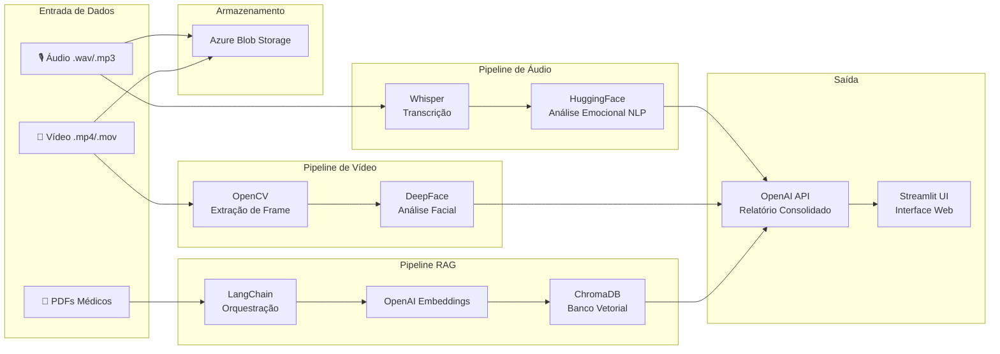
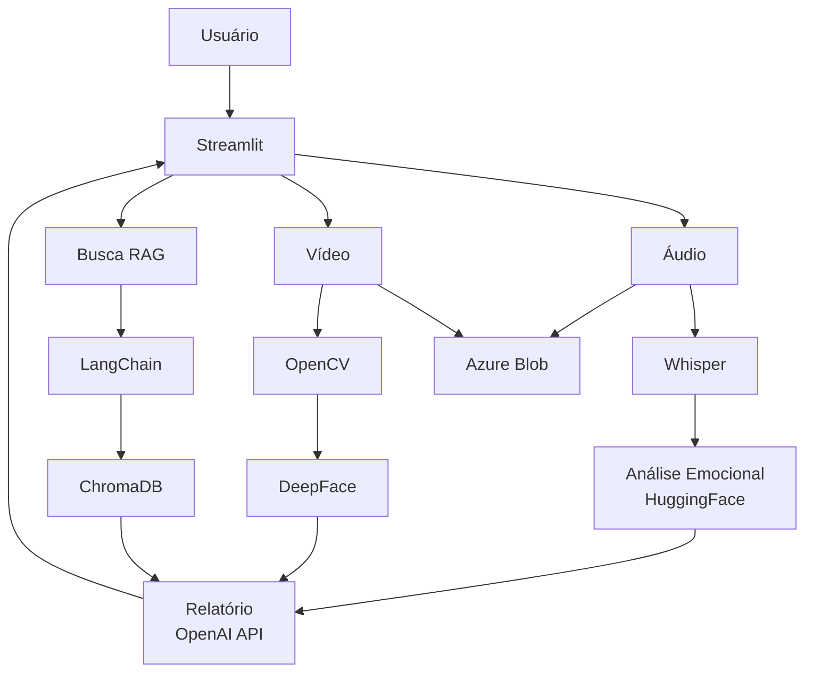
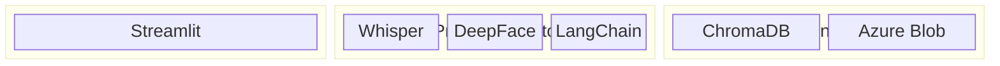

# Arquitetura Multimodal — Diagrama

## Pipeline Completo

```mermaid
flowchart LR
    subgraph Input["Entrada de Dados"]
        A1[🎙️ Áudio .wav/.mp3]
        A2[🎥 Vídeo .mp4/.mov]
        A3[📄 PDFs Médicos]
    end

    subgraph Audio["Pipeline de Áudio"]
        B1[Whisper\nTranscrição]
        B2[HuggingFace\nAnálise Emocional NLP]
    end

    subgraph Video["Pipeline de Vídeo"]
        C1[OpenCV\nExtração de Frame]
        C2[DeepFace\nAnálise Facial]
    end

    subgraph RAG["Pipeline RAG"]
        D1[LangChain\nOrquestração]
        D2[OpenAI Embeddings]
        D3[ChromaDB\nBanco Vetorial]
    end

    subgraph Output["Saída"]
        E1[OpenAI API\nRelatório Consolidado]
        E2[Streamlit UI\nInterface Web]
    end

    subgraph Cloud["Armazenamento"]
        F1[Azure Blob Storage]
    end

    A1 --> B1 --> B2
    A2 --> C1 --> C2
    A3 --> D1 --> D2 --> D3

    B2 --> E1
    C2 --> E1
    D3 --> E1

    E1 --> E2

    A1 --> F1
    A2 --> F1
```

## Fluxo Simplificado

```mermaid
flowchart TD
    U[Usuário] --> UI[Streamlit]

    UI --> AUD[Áudio]
    UI --> VID[Vídeo]
    UI --> RAG[Busca RAG]

    AUD --> W[Whisper] --> NLP[Análise Emocional\nHuggingFace]
    VID --> CV[OpenCV] --> DF[DeepFace]
    RAG --> LC[LangChain] --> CB[ChromaDB]

    NLP --> RPT[Relatório\nOpenAI API]
    DF --> RPT
    CB --> RPT

    AUD --> AZ[Azure Blob]
    VID --> AZ

    RPT --> UI
```

## Componentes por Camada

```mermaid
block-beta
    columns 3

    block:interface["Interface"]
        Streamlit
    end

    block:processing["Processamento"]
        Whisper
        DeepFace
        LangChain
    end

    block:storage["Armazenamento"]
        ChromaDB
        Azure["Azure Blob"]
    end
```
